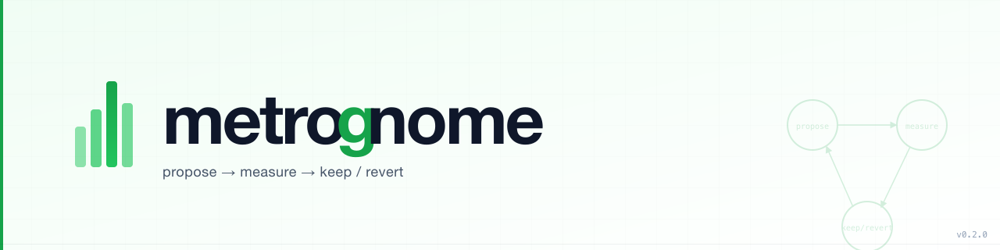
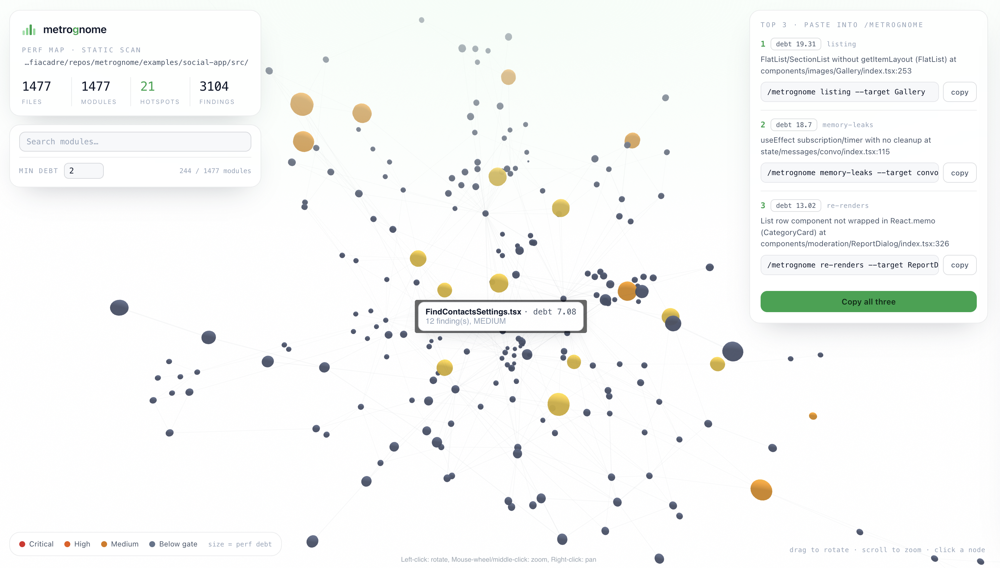
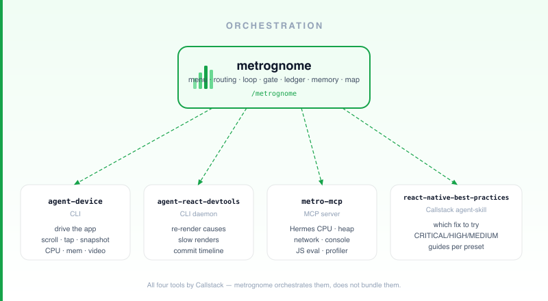
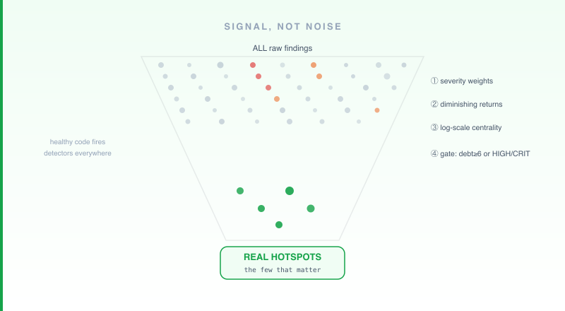
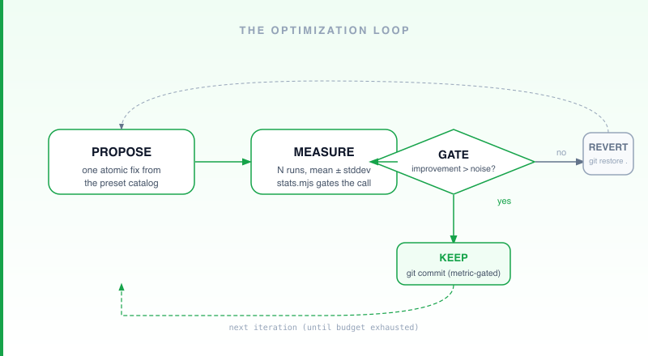
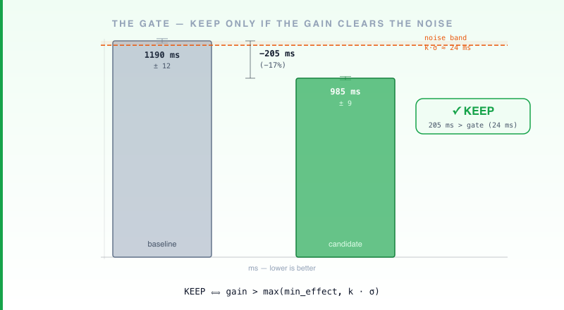

> ➡️ **Moved to [github.com/uphold/metrognome](https://github.com/uphold/metrognome).** This repo is archived and read-only.



[](https://github.com/xavi-999/metrognome/actions/workflows/ci.yml)
[](https://github.com/xavi-999/metrognome/releases)
[](https://www.npmjs.com/package/metrognome)
[](https://www.npmjs.com/package/metrognome)
[](./LICENSE)
[](https://xavi-999.github.io/metrognome/)

> **The autonomous performance engineer for React Native.** `/metrognome`: one command turns scattered RN performance tooling into a single, scientific loop — **propose → measure → keep/revert** — that ships gains it can prove.

For any React Native developer chasing TTI, memory leaks, jank, bundle size, or re-renders: one `/metrognome` call researches, optimizes, and verifies autonomously — and every gain it reports is one it measured.
One input, zero human interaction, flabbergasting performance improvements.

Works with **Claude Code, OpenAI Codex CLI, Cursor, Gemini CLI, and GitHub Copilot CLI.**

Inspired by OpenAI co-founder Andrej Karpathy's `/autoresearch` [skill](https://github.com/karpathy/autoresearch). Fully adapted to React Native.

## What `/metrognome` solves

React Native performance tooling is powerful but scattered — each tool knows one thing, nothing shares context between sessions, and there's no gate between "this might help" and "this actually helped." metrognome routes each measurement to the right tool and runs a loop with a real gate: one fix at a time, measured N times, kept only if the gain clears the noise — else reverted.



▶ [**Explore the live 3D map**](https://xavi-999.github.io/metrognome/perf-map.html) — a real scan of bluesky's [social-app](https://github.com/bluesky-social/social-app) — and the [live run report](https://xavi-999.github.io/metrognome/report.html).

---

## Architecture

metrognome routes each measurement to the right tool, then owns the loop, the gate, the ledger, the memory, and the map:



agent-device, agent-react-devtools, and react-native-best-practices are independent open-source projects by **Callstack**; metro-mcp is an independent open-source project. metrognome does not bundle or modify them, it conducts them. See [Attribution](#attribution).

---

## What `/metrognome` does

Run `/metrognome` for a menu (or pass args / plain English to skip it):

1. **Autoresearch** — pick a preset, run the autonomous loop:
   `first-load` (TTI) · `listing` (FPS/jank) · `memory-leaks` (RAM) · `bundle-size` · `re-renders`.
   Each iteration applies **one atomic fix**, re-measures with an N-run protocol, and keeps it **only if the gain beats the measurement noise** — otherwise it auto-reverts. Kept changes are metric-gated; the final commit shape is configurable (per-iteration · one commit · leave staged).

2. **Perf Map 3D** — a static, device-free scan of the repo → an interactive 3D force-graph (open it in any browser, fully offline). Node **size = perf debt**, **color = severity**. Click a node for the flaw, `file:line`, and the matching Callstack guide. Emits a **Top-3** you paste straight back into Autoresearch.

3. **Doctor** — verify/install the toolchain, check a live Metro session + a clean git tree, and bootstrap the repo's `.metrognome/` memory.

```bash
# Perf Map, by hand:
node skills/metrognome/scripts/perf_scan.mjs <your-rn-app> --out graph.json
node skills/metrognome/scripts/build_perf_map.mjs graph.json --out perf-map.html --open
```

### CI Autopilot (autonomous, weekly)

metrognome also runs as a **weekly CI agent** — no human in the loop. A GitHub Actions
workflow scans the repo, picks the top debt findings, autoresearches fixes, and opens a
PR with the measured gains and *why* each fix was chosen.

Two templates in [`templates/ci/`](templates/ci/):
- **Device-free** (recommended): measures `bundle-size`, defers device-only findings.
  Runs on any `ubuntu-latest` runner, always reliable.
- **Device**: boots an Android emulator; all 5 presets measurable. Heavier, opt-in.

See [`templates/ci/README.md`](templates/ci/README.md) for setup, cost, and gotchas.

---

## What the skill offers

**Modes** (`/metrognome` menu):

| Mode | What it does |
|---|---|
| **Autoresearch** | Pick a preset; asks commit mode + live report (opt-in); runs the autonomous measure→fix→keep/revert loop. |
| **Perf Map 3D** | Device-free static scan → interactive HTML force-graph → Top-3 hotspots. |
| **Doctor** | Verifies/installs the toolchain, checks Metro + clean tree, bootstraps `.metrognome/` (including `config.json`). |
| **Configurations** | View/edit `.metrognome/config.json` — commit mode, live report, N, k, budget. |

**Presets** (Autoresearch):

| Preset | Target metric |
|---|---|
| `first-load` | TTI — cold-start time to interactive |
| `listing` | FPS / jank — dropped frames in FlatList/SectionList/FlashList |
| `memory-leaks` | RAM — JS heap growth across open↔close cycles |
| `bundle-size` | Bundle bytes — JS output size |
| `re-renders` | Re-render count — wasted component commits |

**Scripts / CLIs** (device-free unless noted):

| Script | npm alias | What it does |
|---|---|---|
| `perf_scan.mjs` | `npm run scan` | Scans an RN repo, emits `graph.json` of perf hotspots |
| `build_perf_map.mjs` | `npm run map` | Renders `graph.json` → standalone HTML 3D force-graph |
| `build_run_report.mjs` | `npm run report` | Renders `run-state.json` → live HTML progress dashboard |
| `stats.mjs` | `npm run stats:test` | Statistical gate (mean ± stddev, keep/revert decision) — self-testable |
| `build_playbook.mjs` | `npm run playbook` | Distils ledger runs into `playbook.md` + `playbook.json` (proven wins / dead ends) |
| `doctor.mjs` | `npm run doctor:test` | Toolchain check, Metro + git preflight, `.metrognome/` bootstrap + `config.json` — self-testable |
| `heap_sample.mjs` | — | JS-heap leak sampling across open↔close cycles — needs a live app |

Installed-plugin path: `${CLAUDE_PLUGIN_ROOT}/skills/metrognome/scripts/<script>`.

---

### Signal, not noise



Static RN heuristics fire constantly in healthy code. The Perf Map's scoring is designed to surface the structural problems that actually matter — not every inline prop and missing `memo`. How it stays selective: severity weights, diminishing returns, structural-only centrality, and a combined debt+severity gate. Details and tuning constants: `skills/metrognome/references/perf-map.md`.

---

## Install

```
/plugin marketplace add xavi-999/metrognome      # or a local path to this repo
/plugin install metrognome
```

This registers the `/metrognome` command, the orchestrator skill, the bundled `metro-mcp` MCP server, and the perf-memory hook. Then run **Doctor** once in your RN app to install the CLI tools and bootstrap `.metrognome/`.

**Scripts need `npm install`:** When used inside a Claude session the SessionStart hook installs dependencies automatically. For by-hand / CI use (e.g. `npm run scan`), run `npm install` in the plugin directory first.

#### Other agents (Codex · Cursor · Gemini · Copilot)

Register the `metro-mcp` MCP server, drop the `metrognome` skill into your agent's skills directory, and run scripts with `npx metrognome@latest <scan|map|report|doctor|…>`. See [COMPATIBILITY.md](./COMPATIBILITY.md) for per-harness config snippets.

---

## Quickstart

### Map your app (no device needed)

1. Run `/metrognome` → select **Perf Map 3D**.
2. metrognome scans the repo, builds a standalone HTML map, and opens it — node **size = debt**, **color = severity**.
3. Click a hotspot → flaw, `file:line`, and the matching fix guide.
4. Copy the printed **Top-3** command, e.g. `/metrognome listing --target FeedScreen`.

**By hand** (CI / no Claude):
```bash
npm run scan -- path/to/your-rn-app --out graph.json
npm run map  -- graph.json --out perf-map.html --open
```

### Run the loop

Paste a Top-3 command (or pick **Autoresearch** → preset from the menu) — metrognome measures, applies one fix, keeps it only if the gain beats the noise, else auto-reverts. *Needs the live toolchain + Metro + a clean tree — run Doctor first* (see [Requirements & constraints](#requirements--constraints)).

---

## Requirements & constraints

- **Node ≥ 18**; a React Native / Expo app on **Metro + Hermes**.
- **`npm install` in plugin root** — required before running scripts by hand or in CI. Inside a Claude session the SessionStart hook does this automatically.
- **Perf Map + stats need no device.** The live loop needs a simulator/emulator/device + a running Metro session.
- **Live-loop toolchain** (installed via Doctor): `agent-device`, `agent-react-devtools` (CLIs), `metro-mcp` (bundled MCP), and the `react-native-best-practices` Callstack agent-skill.
- **Clean git tree required for Autoresearch** — git is the experiment log; auto-revert needs a clean baseline. Doctor refuses to run dirty. The final commit shape is configurable via `.metrognome/config.json` (`commitMode`: `per-iteration` · `one-commit` · `no-commit`).
- **Device loop is local.** The full loop (all presets) needs live Metro + a device — device-measured presets (`listing`, `re-renders`, `memory-leaks`, `first-load`) cannot run as a cloud cron without an emulator. The **device-free autopilot** (`bundle-size` preset) *does* run headless — see [`templates/ci/`](templates/ci/).
- **iOS Simulator blind spot:** displayed-frame **FPS** is unavailable (Apple constraint — Simulator renders on the host GPU). Every other signal (JS heap, re-renders, longtask jank, TTI, CPU/RAM) works on Simulator. For FPS: use **Flashlight** (Android) or **Instruments/XCTest** (real iOS device).
- **RN < 0.85: one CDP connection.** Close all RN DevTools / Fusebox windows before metro-mcp runtime calls.
- **Expo / New Arch:** if metro-mcp runtime calls time out, set `newArchitecture: true`; `listing`/`re-renders` degrade to the CDP-free path (metro-mcp unverified offline).
- **Discipline:** one variable per iteration; never record an unmeasured fix.

---

## How the loop stays honest



- **N-run variance control.** Every metric is measured N times (default 5, one warm-up discarded); decisions use mean ± stddev, not a single sample.
- **The gate.** Keep a change iff `improvement > max(min_effect, k·pooled_stddev)` (k≈2). If it can't be distinguished from device jitter, it's reverted. (`scripts/stats.mjs`, self-testable.)



- **Git as experiment log.** Clean tree required; per-iteration commits enable instant `git restore .` revert. The final commit shape is configurable: keep each commit, squash to one, or leave staged for review.
- **Experiment Ledger** (`.metrognome/ledger/`) records every run verbosely; **Performance Memory** (`.metrognome/perf-memory.md`) distills each into one durable line, committed with the app so the whole team inherits the knowledge.

---

## Repo layout

```
.claude-plugin/      plugin.json + marketplace.json (self-installable)
.mcp.json            bundles metro-mcp
commands/            /metrognome entrypoint
hooks/               SessionStart (npm install) + UserPromptSubmit (perf-memory nudge)
skills/metrognome/
  SKILL.md           the orchestrator (menu, routing, loop, gate, ledger, memory, config)
  references/        presets · tools · measurement · perf-map · memory
  scripts/           perf_scan · build_perf_map · build_run_report · stats · build_playbook · doctor · heap_sample
  assets/            vendored 3d-force-graph · HTML templates · ledger template · sample run-state
docs/                banner.svg/png · perf-map.png · diagrams/ (loop · orchestration · gate · signal-vs-noise)
examples/            sample-rn-app fixture with seeded anti-patterns
```

In the target RN repo, Doctor bootstraps:
- `.metrognome/perf-memory.md` — cumulative performance brain (committed with the app)
- `.metrognome/config.json` — run settings: commit mode, live report, N, k, budget
- `.metrognome/ledger/` — verbose per-run experiment logs
- `.metrognome/archive/` — compacted old memory
- `.metrognome/.gitignore` — excludes generated artifacts (`report.html`, `run-state.json`)

---

## Attribution

metrognome orchestrates these independent open-source tools. agent-device, agent-react-devtools, and react-native-best-practices are by **Callstack**; metro-mcp is by its own contributors. None are bundled or modified here; all trademarks and copyrights belong to their owners.

- **metro-mcp** — MCP server bridging Metro via CDP — https://www.npmjs.com/package/metro-mcp
- **agent-device** — device-driving CLI — https://www.npmjs.com/package/agent-device
- **agent-react-devtools** — React telemetry CLI daemon — https://www.npmjs.com/package/agent-react-devtools
- **react-native-best-practices** — perf knowledge base — https://github.com/callstackincubator/agent-skills

The Perf Map vendors, unmodified, the offline browser build of **3d-force-graph** by Vasco Asturiano (MIT) — https://github.com/vasturiano/3d-force-graph (license in `skills/metrognome/assets/3d-force-graph.LICENSE`).

## License

MIT — see [LICENSE](./LICENSE).